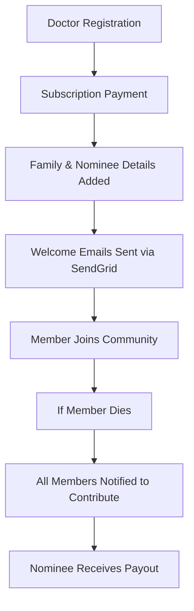
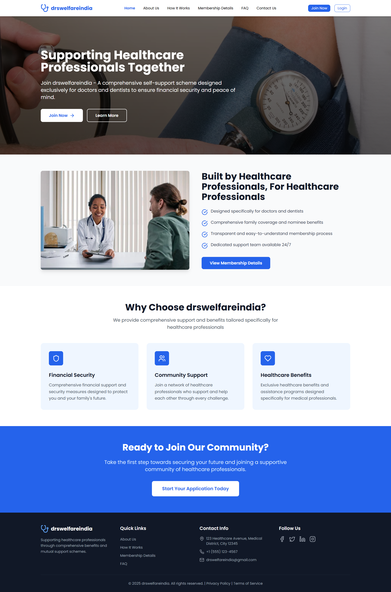
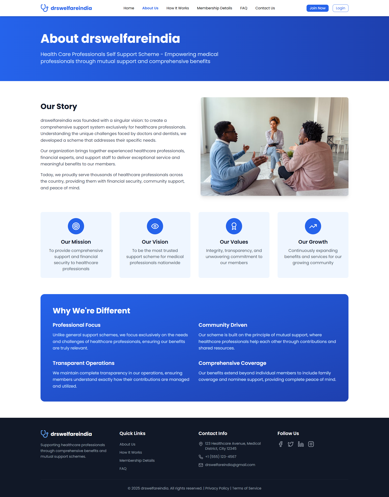
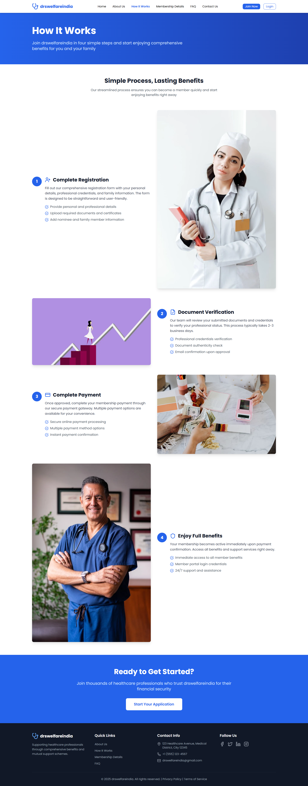
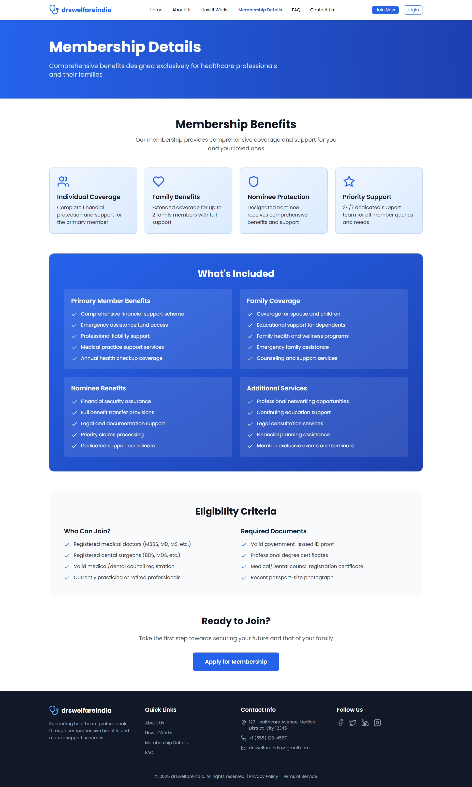
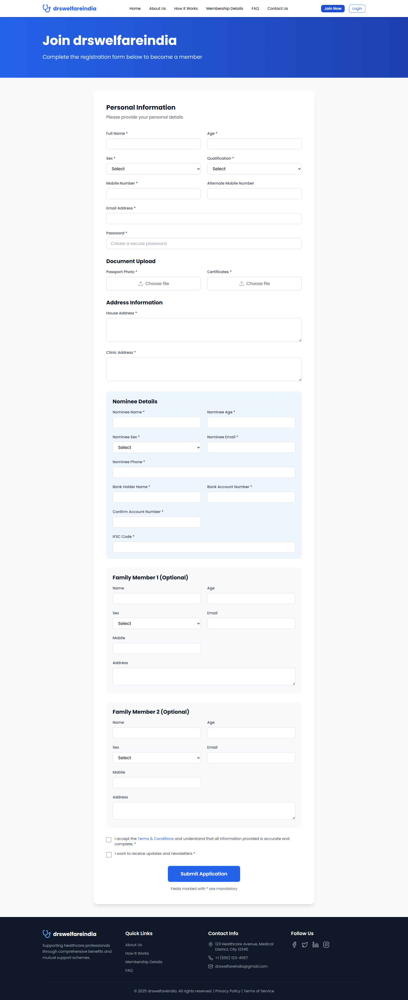

# 🩺 Doctors Community Management System


---

## 🔍 Overview

The **Doctors Community Management System** is a web platform that connects doctors under a unified community network. Doctors can register, subscribe, and include their family and nominee details. When a member passes away, all community members contribute a defined amount, and the collected fund is securely transferred to the nominee.

This system ensures financial support for doctors’ families, while providing a transparent, secure, and automated membership and notification process.

---

## 🎯 Problem Statement

* ⚕️ No centralized community system to support doctors and their families.
* 📋 Manual registration and record-keeping create delays and confusion.
* 📧 Lack of automated email alerts for registration and updates.
* 💰 No structured mechanism for community-based financial contributions and payouts.

---

## 💡 Features

| Feature                                  | Description                                                                                                          |
| ---------------------------------------- | -------------------------------------------------------------------------------------------------------------------- |
| 🩺 **Doctor Registration**               | Doctors register and subscribe to join the community.                                                                |
| 👨‍👩‍👧‍👦 **Family & Nominee Details** | Add and manage family members and nominee details.                                                                   |
| 🏦 **Bank Details Handling**             | Securely store nominee’s bank details for fund transfer.                                                             |
| 📧 **Email Notifications**               | Automated emails for registration, updates, and community alerts using SMTP and SendGrid.                            |
| 🎉 **Welcome Mail**                      | Sends a welcome email with community terms and conditions to the doctor, their family, and nominee.                  |
| ⚰️ **Death Claim Process**               | In the event of a member’s death, all members are notified to contribute; the nominee receives the collected amount. |
| 🔐 **Secure Authentication**             | Encrypted passwords using bcrypt and JWT-based authentication for secure login.                                      |

---

## 🛠 Tech Stack

| Layer                | Technology                    |
| -------------------- | ----------------------------- |
| 🎨 **Frontend**      | React.js                      |
| ⚙️ **Backend**       | Node.js + Express.js          |
| 🗃 **Database**      | MongoDB                       |
| 🔐 **Security**      | JWT (JSON Web Tokens), bcrypt |
| 📬 **Email Service** | SMTP, SendGrid                |
| 🧪 **Testing**       | Postman, Thunder Client       |

---

## 🧪 Inputs & Outputs

| Inputs                                                       | Outputs                                                                         |
| ------------------------------------------------------------ | ------------------------------------------------------------------------------- |
| Doctor registration with subscription, family & nominee info | Welcome email sent to doctor, family members, and nominee                       |
| Account updates (family, nominee, or bank info)              | Notification email sent to registered users                                     |
| Death confirmation by admin                                  | Payment contribution notification sent to members; payout processed for nominee |

---

## ⚙️ Workflow



---

## 👥 Team Members

| Name            | Contribution                                               |
| --------------- | ---------------------------------------------------------- |
| **Akhil Duddi** | Fullstack development, Authentication, Email notifications |
| **Dhanush**     | Frontend design, Subscription module, Testing & validation |

---

## 🧪 Testing

* ✅ APIs tested with **Postman** and **Thunder Client**
* ✅ Email workflows verified using **SendGrid sandbox testing**
* ✅ Manual browser-based testing for all user flows

---

## 🚀 How to Run Locally

```bash
# Clone the repository
git clone https://github.com/akhilduddi/Doctors-welfare.git

# Backend setup
cd backend
npm install
npm start

# Frontend setup
cd frontend
npm install
npm run dev
```

### ⚙️ Environment Variables (`.env`)

```bash
MONGO_URI=your_mongodb_connection_string
JWT_SECRET=your_secret_key
SENDGRID_API_KEY=your_sendgrid_key
SMTP_USER=your_email
SMTP_PASS=your_password
```


## 📸 Screenshots 








---


🔥 If you like this project, don’t forget to **star ⭐ the repo!**

